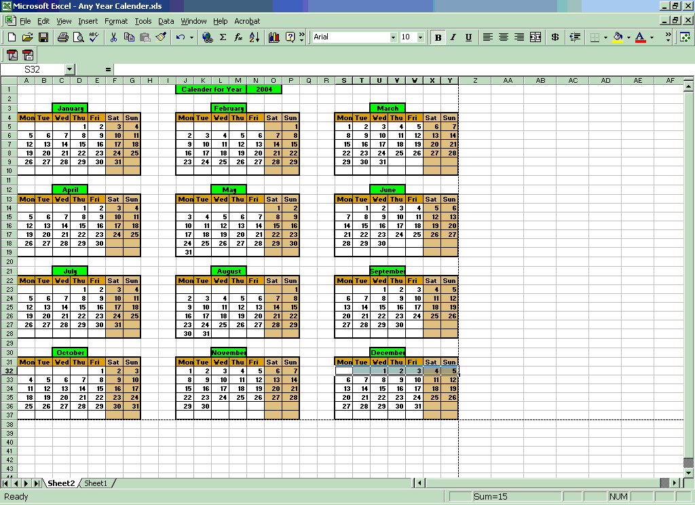

## Any Year Calendar

### Description

This excel marco generates Calendar for any year in a new spreadsheet. Good learning tool for Excel Macros. Don't forget to vote :-)
 
### More Info
 

             |
---                |---
**Submitted On**   |2004-08-02 17:28:12
**By**             |[Parmender Dahiya](https://github.com/Planet-Source-Code/PSCIndex/blob/master/ByAuthor/parmender-dahiya.md)
**Level**          |Intermediate
**User Rating**    |4.4 (48 globes from 11 users)
**Compatibility**  |VBA MS Excel
**Category**       |[Microsoft Office Apps/VBA](https://github.com/Planet-Source-Code/PSCIndex/blob/master/ByCategory/microsoft-office-apps-vba__1-42.md)
**World**          |[Visual Basic](https://github.com/Planet-Source-Code/PSCIndex/blob/master/ByWorld/visual-basic.md)
**Archive File**   |[Any\_Year\_C177695822004\.zip](https://github.com/Planet-Source-Code/parmender-dahiya-any-year-calendar__1-55254/archive/master.zip)

